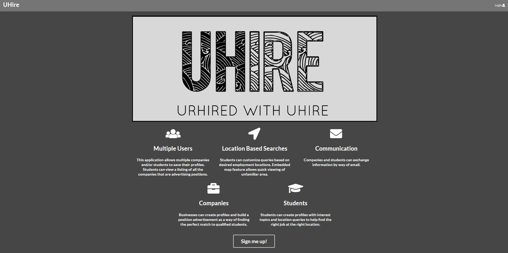
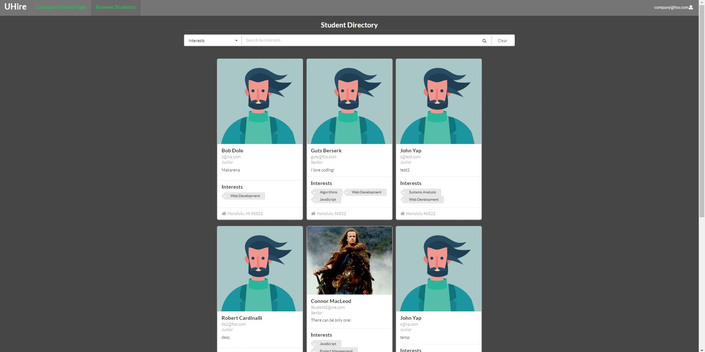
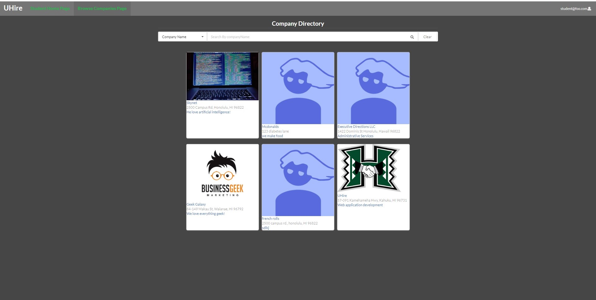

<h3>About</h3>
[UHire](https://uhire.github.io/) is a web app created by me and four others. It was created for ICS 314 Software Engineering class in the spring semester of 2019. UHire is a mock website designed so companies can easily post job opportunities for students that attend the University of Hawaii.

Students are able to register an account and create their student profile. They are asked to fill out their information and interests. Students can browse companies and apply for positions that the companies post up. Student profiles will appear on the browse students page so companies can view them and see what their interests are.

Companies are able to register an account and create their company profile. They are asked to fill out their information and are able to post open positions for their company. Companies can browse students and view a student's interest as well as contact them. Company profiles will appear on the browse companies page so students can view them and see what positions are available.

<h3>Experiences</h3>
This project was a fun experience. I had a great group. We communicated very well with each other through Slack and Discord. However it was not an easy project, we all had our own set of problems. Since I am pretty new to Meteor and React it was a challenge trying to figure things out, but I learned many things along the way. One of the goals of this project was to development a nice and functional webapp. The other goals were to learn how to work as a team, deal with issues, meet deadlines, and learn to deal with merge conflicts with github. I feel that, my group and I accomplished our goals for this project and worked very hard to deal with the challenges. Overall it was a very positive experience.
